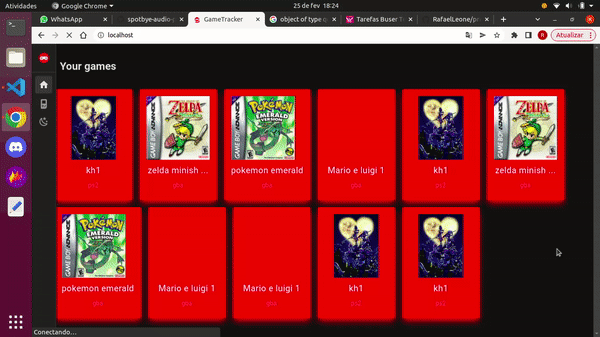

# GameTracker

Um app que permite que você registre seus jogos da maneira que quiser e mantém uma biblioteca para que você não perca o foco daquilo que realmente quer jogar.  
Adicione jogos, e mude se está em backlog, jogando ou completo.
Ao poder adicionar como quiser, você pode até ter o mesmo jogo 2 vezes, mas com dificuldades diferentes, por exemplo.

## **Vídeo de apresentação**
[*Link para o vídeo*](https://www.loom.com/share/e00696fb397f4deb8d03809d14fe808c)  

  

<br>

## **Como rodar o projeto**

```bash
docker compose up --build
```

Se deu tudo certo, acesse localhost em seu navegador. Se não:  

## O que pode dar errado?

1 - Pode haver outro docker rodando. Rode:  
docker-compose down  
Para tirar os containers que subimos agora. Rode:  
docker ps  
Se ainda houver containers pode ser necessário pará-los com:  
docker kill "número-do-container"  
Esse número geralmente está na primeria coluna do resultado do docker ps  

2 - Pode haver portas já sendo utilizadas. Rode:  
netstat -anp|grep "numero-da-porta"  
Esse projeto pode usar as portas 3000, 3001, 80, 8080 e 8000  
Caso haja algum serviço em alguma dessas portas rode:  
kill -9 "numero-do-PID"  
O PID vai ser o número antes da barra na útlima coluna.  
É bom fazer o passo 1 antes de tentar o docker-compose up novamente!  

<br>

## Focando apenas no front

Verifique se a variável de ambiente **VITE_API_MOCK** é *true* em *frontend/.env*.  
Isso não irá subir o banco nem o back, e você pode focar em desenvolver o front primeiro. Use a apimock para ver como os dados se encaixariam sem ter que ficar populando banco desnecessariamente :)  

Para rodar a aplicação conectada ao backend, basta setar o valor dessa variável para *false*.

## Créditos

[djavue](https://github.com/huogerac/djavue)  
[spotbye](https://github.com/vitoiuo/spotbye-audio-player/blob/main/frontend/src/components/GameList.vue)
